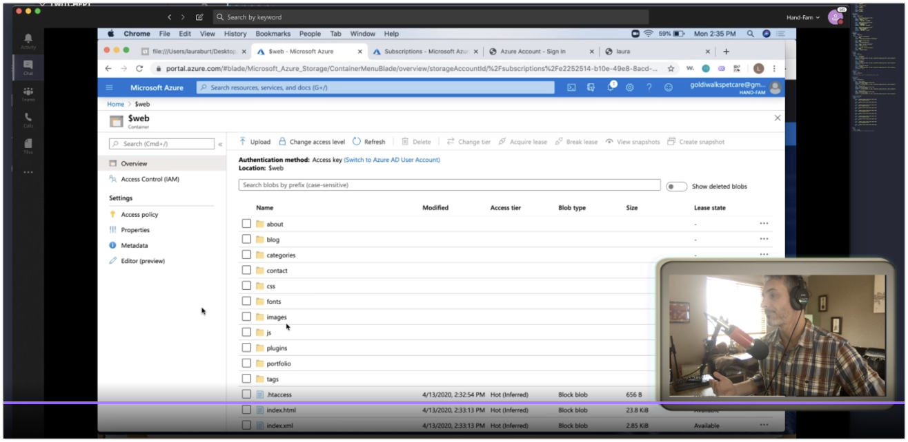

# Twitch Stream Information

This is my central repository for everything I do on Twitch.

|Episode   |Topic   |Date   |Watch   |
|---|---|---|---|
|1   |[Building a Static Website Using Hugo, Azure storage, and Netlify (Twitch Episode 01)](/ep01/README.md)   |4/13/20   | [📼](https://youtu.be/jRgcvNpzpL0)  |
|2   |[Deploying a Serverless URL Shortener with Azure Functions (Twitch - Episode: 02)](/ep02/README.md)   |4/14/20   | [📼](https://youtu.be/qhy5aNUqIMc)  |
|3   |[Part 2: Building a Static Website with Hugo, Azure Storage, and Netlify (Twitch Episode 03)](/ep03/README.md)   |4/15/20   |[📼](https://youtu.be/StmINse2jME)   |
|4   |[Analyze Tweets with Azure Machine Learning and Cosmos DB](/ep04/README.md)   |4/22/20   |[📼](https://youtu.be/cR86v2CgvGc)   |
|5   |[Intro to Version and Source Control with git and GitHub (Twitch Episode 5)](/ep05/README.md)   |4/23/20   |[📼](https://youtu.be/vTrBZbISdwM)   |
|6   |[Rolling Your Own Jitsi Service on Azure (Twitch Episode 6)](/ep06/README.md)   |4/28/20   |[📼](https://youtu.be/y66qrgnWWbA)   |