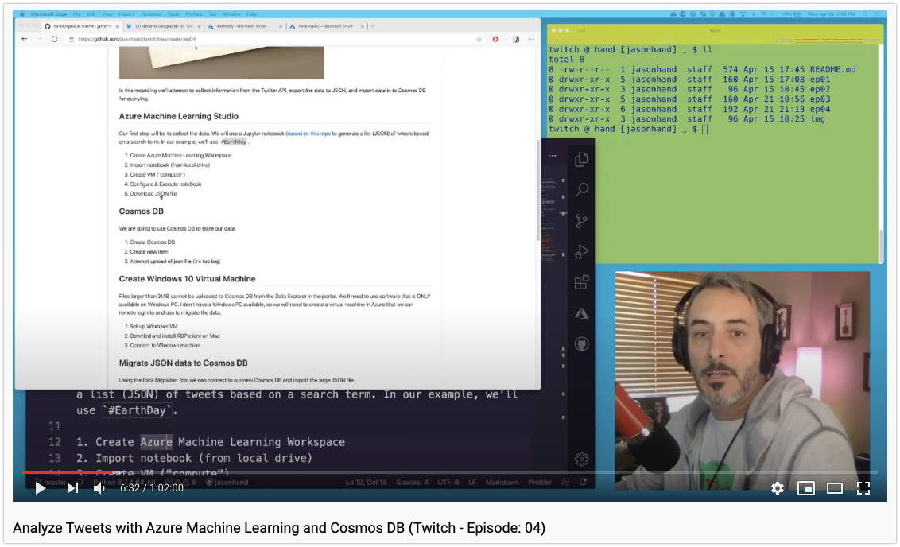

# Analyzing Tweets with Azure Machine Learning and Cosmos DB


In this recording we'll attempt to collect information from the Twitter API, export the data to JSON, and import data in to Cosmos DB for querying.

[](https://youtu.be/cR86v2CgvGc)

## Azure Machine Learning Studio

Our first step will be to collect the data. We will use a Jupyter notebook ([based on this repo](
https://github.com/Dkreitzer/Twitter_Scraping_and_Saving) to generate a list (JSON) of tweets based on a search term. In our example, we'll use `#EarthDay`.

[Create a free Machine Learning Account](https://azure.microsoft.com/en-us/free/machine-learning/?WT_.mc_id=github-twitch04-jahand)

1. [Create Azure Machine Learning Workspace](https://docs.microsoft.com/en-us/azure/machine-learning/how-to-manage-workspace/?WT_.mc_id=github-twitch04-jahand)
2. Import notebook (from local drive)
3. Create VM ("[compute](https://docs.microsoft.com/en-us/azure/machine-learning/concept-compute-instance/?WT_.mc_id=github-twitch04-jahand)")
4. Configure & Execute [Jupyter notebook](https://docs.microsoft.com/en-us/azure/machine-learning/samples-notebooks/?WT_.mc_id=github-twitch04-jahand)
5. Download JSON file

## Cosmos DB

We are going to use Cosmos DB to store our data.

1. [Create Cosmos DB](https://docs.microsoft.com/en-us/azure/cosmos-db/create-cosmosdb-resources-portal/?WT_.mc_id=github-twitch04-jahand)
2. Create new item
3. Attempt upload of json file (it's too big)

## Create Windows 10 Virtual Machine

Files larger than 2MiB cannot be uploaded to Cosmos DB from the Data Explorer in the portal. We'll need to use software that is ONLY available on Windows PC. I don't have a Windows PC available, so we will need to create a virtual machine in Azure that we can remote login to and use to migrate the data.

1. [Set up Windows 10 Virtual Machine](https://docs.microsoft.com/en-us/azure/virtual-machines/windows/quick-create-portal/?WT_.mc_id=github-twitch04-jahand)
2. [Downlod and install](https://apps.apple.com/us/app/microsoft-remote-desktop-10/id1295203466?mt=12) RDP client on Mac
3. [Connect to Windows machine](https://docs.microsoft.com/en-us/azure/virtual-machines/windows/connect-logon/?WT_.mc_id=github-twitch04-jahand)

>NOTE: Honestly, that last resource link (connect to windows machine) isn't that helpful for using the RDP app I suggest in step 2. It's pretty self-explanatory but I'll work on a separate set of instructions specific to these tools (and being on a Mac).

## Migrate JSON data to Cosmos DB

Using the Data Migration Tool we can connect to our new Cosmos DB and import the large JSON file.

1. [Download and install](https://aka.ms/csdmtool) the Document DB Data Migration Tool
2. Download json file
3. [Import json file to Cosmos DB](https://docs.microsoft.com/en-us/azure/cosmos-db/import-data/?WT_.mc_id=github-twitch04-jahand)
4. [View Data Explorer in Cosmos Db](https://docs.microsoft.com/en-us/azure/cosmos-db/data-explorer/?WT_.mc_id=github-twitch04-jahand)

## Querying our data

1. [Query data](https://docs.microsoft.com/en-us/azure/cosmos-db/sql-query-getting-started/?WT_.mc_id=github-twitch04-jahand) with the following queries

### Sample Query 1:

```SQL
SELECT c.entities.hashtags FROM c
```

### Sample Query 2:

```SQL
SELECT { "hashtags": c.entities.hashtags, "user mentions": c.entities.user_mentions, "urls": c.urls }
    FROM Hashtags c
 ```

## Clean up

Because I need to [generate a set of keys](https://developer.twitter.com/) for the demo, I will then remove and regenerate the Twitter API keys.

1. Rotate API keys

## Resources

- [Azure](https://azure.microsoft.com/free/?WT_.mc_id=github-twitch04-jahand)
- [Azure Machine Learning](https://docs.microsoft.com/en-us/azure/machine-learning/?WT_.mc_id=github-twitch04-jahand)
- [Developer.twitter.com](https://developer.twitter.com/)
- [Tweepy](https://tweepy.org)
- [Azure Virtual Machines](https://docs.microsoft.com/en-us/azure/virtual-machines/?WT_.mc_id=github-twitch04-jahand)
- [Microsoft Remote Desktop 10](https://apps.apple.com/us/app/microsoft-remote-desktop-10/id1295203466?mt=12)
- [Visual Code Studio](https://code.visualstudio.com/docs/?WT_.mc_id=github-twitch04-jahand)
- [Windows Terminal](https://www.microsoft.com/en-us/p/windows-terminal-preview/9n0dx20hk701/?WT_.mc_id=github-twitch04-jahand)
- [Azure Cosmos DB](https://docs.microsoft.com/en-us/azure/cosmos-db/introduction/?WT_.mc_id=github-twitch04-jahand)
- [Data Migration Tool](https://aka.ms/csdmtool)
- [Getting Started with SQL queries in Cosmos DB](https://docs.microsoft.com/en-us/azure/cosmos-db/sql-query-getting-started/?WT_.mc_id=github-twitch04-jahand)

## More

- [Use Data migration tool to migrate your data to Azure Cosmos DB](
https://docs.microsoft.com/en-us/azure/cosmos-db/import-data/?WT_.mc_id=github-twitch04-jahand)
- [Sentiment Analysis Repo](
https://github.com/Dkreitzer/Twitter_Scraping_and_Saving)