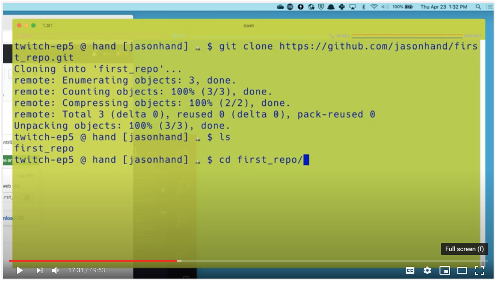

# Intro to Version and Source Control with git and GitHub

[](https://youtu.be/vTrBZbISdwM)

This recording will go through the basics of creating a brand new repository on Github. We will go through two scenarios.

- **Pulling:** Create a new repository on GitHub and clone to the local machine

- **Pushing:** Create a new repository on Github and push existing code from my local machine to the repo

This tutorial assumes you already have a [GitHub](https://github.com/) account and `git` is installed on your local machine.

## Pulling

Code is in a GitHub repository and we want to clone (and sync) it with our local machine.

### Create a New Repository on GitHub and Clone to the Local Machine

1. Choose `New Repository` from the `+` icon in the upper right
2. Assign a name (example: `first_repo`)
3. Give it a description
4. Choose `Private` (***NOTE:** it works the same if you choose Public*)
5. Select the checkbox for `Initialize this repository with a README`
6. Press the green `Create repository` button

## Clone The Repository To Your Local Machine

You'll then be returned to the front page (README) of the new repo.

1. Click the green button that says `Clone or download`
2. Click the clipboard button to copy the `URL`
3. Open your Terminal application
4. Navigate to the directory that you want to clone in to (*example:* `~/dev/`)
5. Clone the repository using the following command in your terminal application

```git
git clone <paste_the_URL_from_clipboard>
```

>IMPORTANT: Make sure the URL you paste after `git clone` includes the `.git` extension.

## Pushing

Files are on our *local machine* and we want to upload (and sync) it with a GitHub repository.

### Create a new repository on Github and push existing code from my local machine to the repo

1. Choose `New Repository` from the `+` icon in the upper right
2. Assign a name (example: `repo_two`)
3. Give it a description
4. Choose `Private` (***NOTE:** it works the same if you choose Public*)
5. **DO NOT** Select the checkbox for `Initialize this repository with a README` (***NOTE**: This is the difference from the previous method above*. We want to *skip this step*)
6. Press the green `Create repository` button

### Push Existing Code to Your New Repository

There are many things you can do with `git`. However, to upload and synchronize a repository only requires a few commands.
The following commands are used in this tutorial.

1. Add file(s) to a collection that will be pushed to the GitHub repository. `git add .`
2. Commit (prepare) the collection with a message to be pushed to a branch in the GitHub repository. `git commit -m "The message"`
3. Push the collection to the `master` branch in the GitHub repository. `git push origin master`

### Adding, Committing, and Pushing code from VS Code

1. Make a change to the README (and save)
2. `Add` and `Commit` using the Source Control feature of VS Code
3. *Push* using `Sync` button in lower left of VS Code

### Deleting Repositories in GitHub

>WARNING: Deleting a repository is permanent. Be carefule with this next section. Only delete repositories you are positive are no longer needed.

1. From the root of the repo (README screen) click the `Settings` link in the upper right
2. Scroll to the bottom of the screen to the `Danger Zone` area
3. Click the very last button that says `Delete this repository`

### Resources

- [Vim editor](https://www.vim.org/)
- [Visual Studio Code](https://code.visualstudio.com/)
- [GitHub](https://github.com/)
- [Git](https://git-scm.com/downloads)
- [What are README files?](https://en.wikipedia.org/wiki/README)