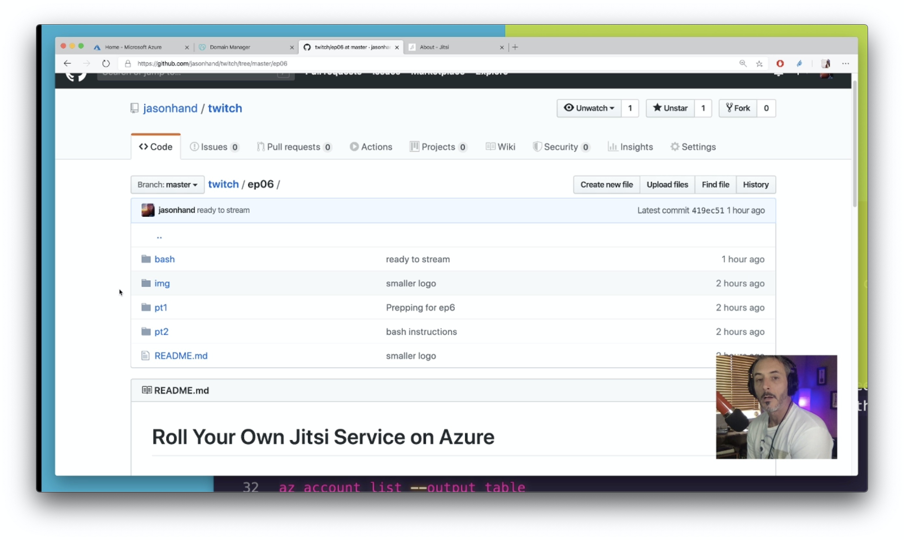

# Roll Your Own Jitsi Service on Azure

In this recording we will step through the process of setting up your own "Zoom"-like video conferencing system. Jitsi is an open source project that provides much of the same functionality and you can host it on your own systems.

Needed:

- [Ubuntu VM](https://docs.microsoft.com/en-us/azure/virtual-machines/?WT_.mc_id=github-twitch06-jahand)
- Domain name

## Part One

[Create the needed resources](/ep06/pt1/README.md)

## Part Two

[Setup the resources](/ep06/pt2/README.md)