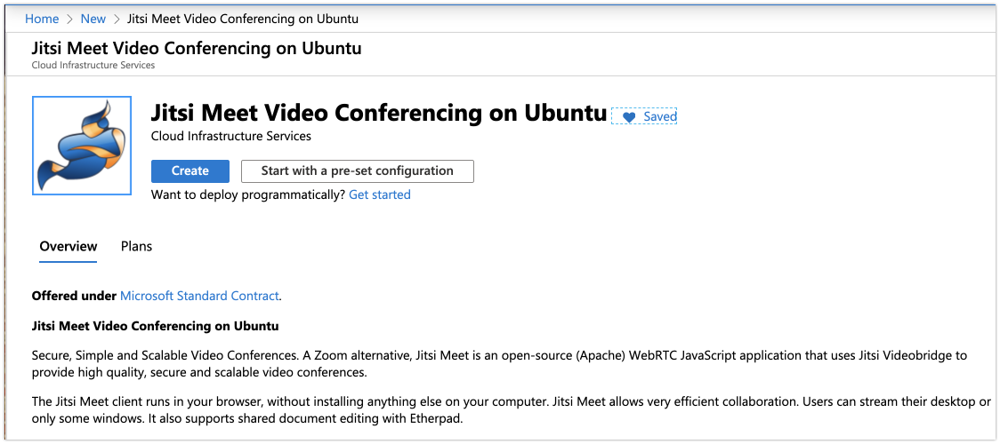

# Roll Your Own Jitsi Service on Azure

**Prerequisites:**

To complete this tutorial you will need the following:

- [Azure Account](http://azure.com/join/?wt.mc_id=github-twitch06-jahand)
- [Azure CLI installed locally](https://docs.microsoft.com/en-us/cli/azure/install-azure-cli?view=azure-cli-latest/?wt.mc_id=github-twitch06-jahand)

## Create Virtual Machine

**Deployment Options:**

1. [Portal](#1-portal)
2. [Command Line (az cli)](#2-command-line-azure-cli)
3. [Azure Resource Manager (ARM) template](#3-azure-resource-manager-arm-template)

## 1. Portal

>NOTE: There is a Jitsi image available when choosing with OS


Follow the [template to deploy](https://azuremarketplace.microsoft.com/en-us/marketplace/apps/cloud-infrastructure-services.jitsi-meet/?wt.mc_id=github-twitch06-jahand) the server and [pick back up with Part 2 of this tutorial](../pt2/README.md).

If you'd like to create all the resources programmatically or from the command line, follow the rest of the instructions below.

## 2. Command Line (Azure CLI)

[Everything that can be performed using the `az account` command can be found here.](https://docs.microsoft.com/en-us/cli/azure/account?view=azure-cli-latest/?wt.mc_id=github-twitch06-jahand)

First, let's make sure we are in the subscription we want to use. To see all subscriptions your account is associated with, run the following from the command line:

```s
az account list --output table
```

You should see all of your subscriptions grouped by `Name, CloudName, SubscriptionID, State, and IsDefault`.

If you'd like to see what subscription you are currently using run:

```s
az account show --output table
```

If this is not the subscription you want to use, run the following command to explicitly select the right one:

```s
az account set --subscription "<yourSubscriptionName>"
```

>NOTE: replace `<yourSubscriptionName>` with the `Name` from the previous `az account show` results)

### View the Jitsi Image Information (Optional)

There are [many images available to us on Azure](https://docs.microsoft.com/en-us/cli/azure/vm/image?view=azure-cli-latest?wt.mc_id=github-twitch06-jahand) that [we can use when deploying virtual machines](https://docs.microsoft.com/en-us/azure/virtual-machines/linux/cli-ps-findimage/?wt.mc_id=github-twitch06-jahand). We are going to select the "Jitsi Meet Video Conferencing on Ubuntu" image. We can view the details by running the following command. However, it does take a few moments to return the results. They are listed below.

```s
az vm image list --offer jitsi --output table --all
```

The resulting output should look like the following:

```s
Offer       Publisher                      Sku         Urn                                                        Version
----------  -----------------------------  ----------  ---------------------------------------------------------  ---------
jitsi-meet  cloud-infrastructure-services  jitsi-meet  cloud-infrastructure-services:jitsi-meet:jitsi-meet:0.0.1  0.0.1
```

### Check for Additional License and Purchase Terms (Optional)

Some of the images available to us for deployment require acceptance of terms prior to using. The Jitsi service is one of those. [By running the following, we can obtain a few values needed](https://docs.microsoft.com/en-us/cli/azure/image?view=azure-cli-latest#az-image-show/?wt.mc_id=github-twitch06-jahand) in order to provision the service from the command line. This is optional for you to run as the results are the same for everyone. That said, if you'd like to see the output, run the following:

```s
az vm image show --location eastus --urn cloud-infrastructure-services:jitsi-meet:jitsi-meet:latest
```

You'll get back:

```json
{
  "dataDiskImages": [],
  "id": "/Subscriptions/cd400f31-6g94-40ab-863a-673192a3c0d0/Providers/Microsoft.Compute/Locations/eastus/Publishers/cloud-infrastructure-services/ArtifactTypes/VMImage/Offers/jitsi-meet/Skus/jitsi-meet/Versions/0.0.1",
  "location": "eastus",
  "name": "0.0.1",
  "osDiskImage": {
    "operatingSystem": "Linux"
  },
  "plan": {
    "name": "jitsi-meet",
    "product": "jitsi-meet",
    "publisher": "cloud-infrastructure-services"
  },
  "tags": null
}
```

We will be including the details found in the `"plan"` from the output above.

### Accept Jitsi Service Terms

To accept the terms [run the following](https://docs.microsoft.com/en-us/cli/azure/vm/image?view=azure-cli-latest#az-vm-image-accept-terms/?wt.mc_id=github-twitch06-jahand):

```s
az vm image accept-terms --urn cloud-infrastructure-services:jitsi-meet:jitsi-meet:latest
```

>NOTE: If you receive a message `The access token is from the wrong issuer`, you need to login to your account using the following: `az login`. This will open a browser for you to authenticate your account. Login, and try the above command again.

You should see output like this:

```json
{
  "accepted": true,
  "id": "/subscriptions/cd400f31-6g94-40ab-863a-673192a3c0d0/providers/Microsoft.MarketplaceOrdering/offerTypes/Microsoft.MarketplaceOrdering/offertypes/publishers/cloud-infrastructure-services/offers/jitsi-meet/plans/jitsi-meet/agreements/current",
  "licenseTextLink": "https://storelegalterms.blob.core.windows.net/legalterms/3E5ED_legalterms_CLOUD%253a2DINFRASTRUCTURE%253a2DSERVICES%253a24JITSI%253a2DMEET%253a24JITSI%253a2DMEET%253a24T622IBUBKL6J3MHL5NUAWG2XNZ5H5FVSJGLCOC54LB63AGIONYH5CDZVDEYDONEFK2NHKCZROAP7ZU5PLZHXJ5ZNBFEUCBOWWMC4DSY.txt",
  "name": "jitsi-meet",
  "plan": "jitsi-meet",
  "privacyPolicyLink": "https://cloudinfrastructureservices.co.uk/privacy-policy/",
  "product": "jitsi-meet",
  "publisher": "cloud-infrastructure-services",
  "retrieveDatetime": "2020-04-27T21:27:55.7777524Z",
  "signature": "FYZPTK7VGYUXSEWJNKYSK7ZPRFUDGFW2N5TUML3Y6D2FIVN6CHIG2DTWPMKLCJJ37IC2AC3EKZET45OQGLEQ3SDFMJMDEH6FR2GM75I",
  "type": "Microsoft.MarketplaceOrdering/offertypes"
}
```

The output includes a `licenseTextLink` to the license terms, and indicates that the value of `accepted` is `true`. This only needs to be done once on your subscription.

### Create a Resource Group

[Now we can create the resource group](https://docs.microsoft.com/en-us/cli/azure/group?view=azure-cli-latest#az-group-create/?wt.mc_id=github-twitch06-jahand) followed by the virtual machine using the following:

```s
az group create --name JitsiResourceGroup --location eastus
```

Results look like:

```json
{
  "id": "/subscriptions/cd400f31-6g94-40ab-863a-673192a3c0d0/resourceGroups/JitsiResourceGroup",
  "location": "eastus",
  "managedBy": null,
  "name": "JitsiResourceGroup",
  "properties": {
    "provisioningState": "Succeeded"
  },
  "tags": null
}
```

### Create a Virtual Machine

Now we [create the virtual machine](https://docs.microsoft.com/en-us/cli/azure/vm?view=azure-cli-latest#az-vm-create/?wt.mc_id=github-twitch06-jahand) with:

```s
az vm create --resource-group JitsiResourceGroup --name JitsiVM --image cloud-infrastructure-services:jitsi-meet:jitsi-meet:latest --plan-name jitsi-meet --plan-product jitsi-meet --plan-publisher cloud-infrastructure-services
```

You'll get output like:

```json
{
  "fqdns": "",
  "id": "/subscriptions/bf8436e1-d5c7-4c0f-b21e-a73990fe5a70/resourceGroups/JitsiResourceGroup/providers/Microsoft.Compute/virtualMachines/JitsiVM",
  "location": "eastus",
  "macAddress": "00-0D-3A-4D-E4-F8",
  "powerState": "VM running",
  "privateIpAddress": "10.0.0.4",
  "publicIpAddress": "104.41.145.173",
  "resourceGroup": "JitsiResourceGroup",
  "zones": ""
}
```

Now we can check out our VM through the portal and [continue the setup in Part 2](../pt2/README.md).

## 3. Azure Resource Manager (ARM) Template

(Coming soon...)

Docs used:

[Azure Command Line Interface](https://docs.microsoft.com/en-us/cli/azure/?view=azure-cli-latest/?WT_.mc_id=github-twitch06-jahand)

[Quickstart: Create a Windows virtual machine with the Azure CLI](
https://docs.microsoft.com/en-us/azure/virtual-machines/windows/quick-create-cli/?WT_.mc_id=github-twitch06-jahand)

[az account](https://docs.microsoft.com/en-us/cli/azure/account?view=azure-cli-latest/?WT_.mc_id=github-twitch06-jahand)
